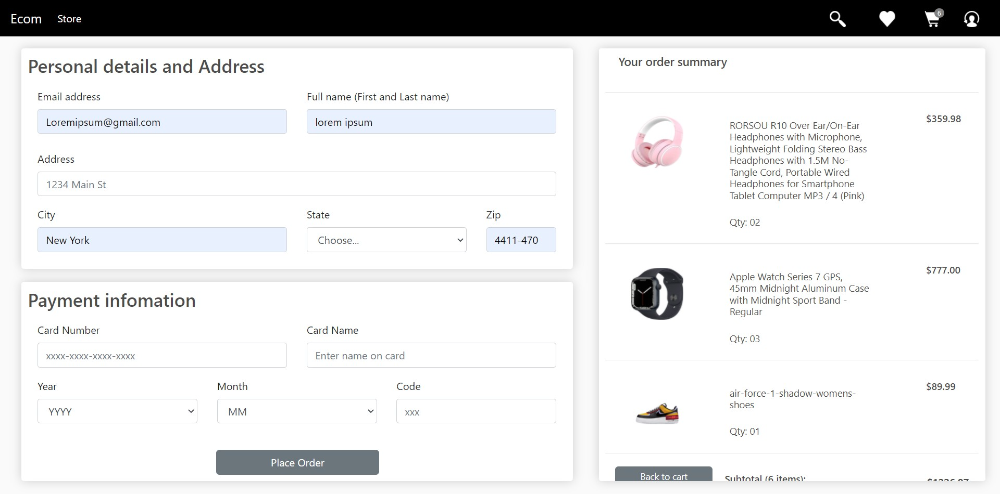

# Ecom-website-repo

## Check out my latest project >> [ ECOM WEB-APP](https://github.com/Mofe1015/Ecom-website-repo)

This ia a Ecommerce website made with DJANGO, PYTHON, JAVASCRIPT, CSS, HTML. The goal is to implement the Django framework for large scale Ecom Web applications, By creating a personal database for products, completion and placement of orders

So far, Cart Functionality , Order Placement and a couple database features (using Django Models ) have been fully implemented. I also hope to integrate Api usage and payment verification with PayPal etc.

## NOTICE!!

    This is just a Project WebApp, certain  features may not be  functional

## Design ❄👌

- Front End: HTML, CSS, Vanilla JS
- Back End: Python, Django

## Building 🏢🚀

1. Clone the repo to your local computer.
2. Make sure you have Flutter and firebase installed.
3. Please add your google-services.json file.
4. import the foodProductsJSON/foodProducts.json to your firestore. (see: https://github.com/dalenguyen/firestore-import-export).
5. The credentials.dart file is intentionaly not included. Create your own credentials file with your own API Keys.
6. Open and run the the project with VS Code or Android Studio 3.x

## Contribution 🍕🗺

Feature requests, issues, pull requests and questions are welcome.

## Bugs 😭🐛

If you encounter any bugs or are facing any issues with the code, please don't hesitate to reach out to me.
email : mofeomotosho@gmail.com

### MOFE
